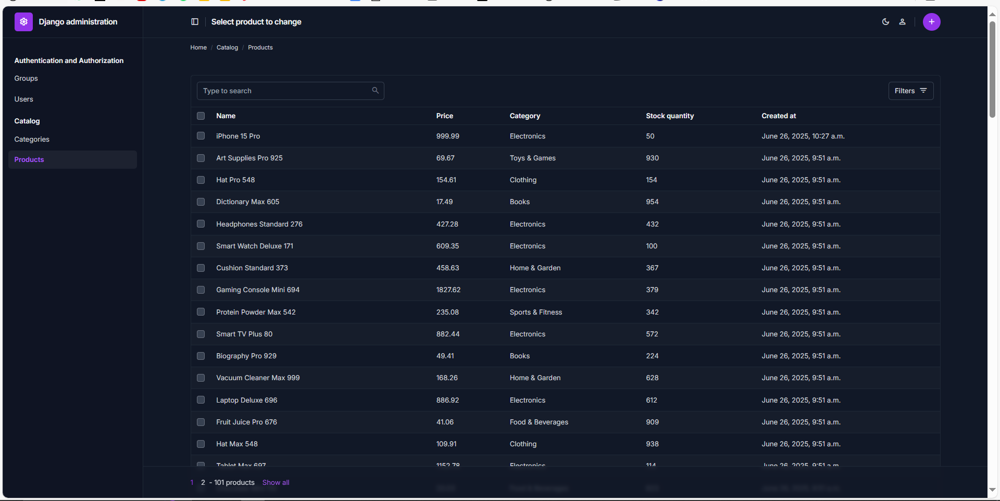

# E-commerce Product Catalog



This is a hobby project building a foundational E-commerce Product Catalog using Django. It features a modern administrative interface powered by **Django Unfold** and provides a **GraphQL API** for flexible data interaction. It's a simple, yet robust, starting point for managing products, categories, and basic inventory.

-----

## Getting Started

Follow these instructions to get a copy of the project up and running on your local machine for development and testing.

### Prerequisites

Ensure you have **Python 3.8+** (or your preferred version) and **pip** (Python package installer) installed.

### Installation

1.  **Clone the repository:**

    ```bash
    git clone https://github.com/JoseSholly/ecommerce_project.git
    cd ecommerce_project
    ```

    *(Replace `https://github.com/JoseSholly/ecommerce_project.git` with your actual repository URL.)*

2.  **Create and activate a virtual environment:**

    ```bash
    # macOS/Linux:
    python3 -m venv venv
    source venv/bin/activate

    # Windows:
    python -m venv venv
    .\venv\Scripts\activate
    ```

3.  **Install dependencies:**
    Make sure your virtual environment is active.

    ```bash
    pip install -r requirements.txt
    ```

4.  **Apply migrations:**

    ```bash
    python manage.py migrate
    ```

5.  **Create a superuser (for admin access):**

    ```bash
    python manage.py createsuperuser
    ```

### Running the Application

1.  **Start the development server:**

    ```bash
    python manage.py runserver
    ```

2.  **Access the application:**
    Open your web browser and navigate to:

      * **Admin Panel:** `http://127.0.0.1:8000/admin/` (Login with your superuser credentials)
      * **GraphQL Playground (GraphiQL):** `http://127.0.0.1:8000/graphql/`

-----

## GraphQL API

This project offers a GraphQL API for interacting with the product catalog data. The API allows you to fetch specific data efficiently and supports both queries (for retrieving data) and mutations (for creating, updating, or deleting data).

The API endpoint is at `http://127.0.0.1:8000/graphql/`, which also hosts a GraphiQL interface for easy schema exploration and testing queries.

### Example Query

Here's how you can query products with their basic details and associated category name:

```graphql
query ProductListing {
  products {
    id
    name
    price
    category {
      name
    }
  }
}
```